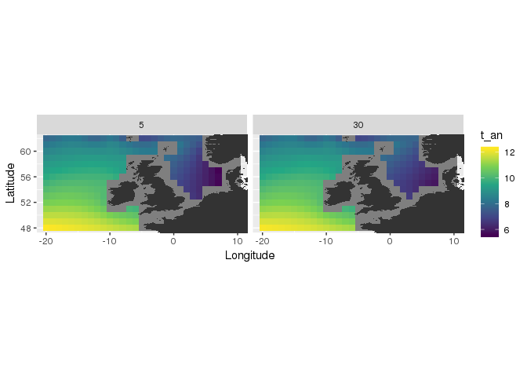

<!-- README.md is generated from README.Rmd. Please edit that file -->
rcdo - easy tools for manipulating netcdf data in R.
====================================================

The goal of rcdo is to provide an easy to use interface to the command line tool data operators.

Installation
------------

You can install the development version of rcdo using.

``` r
# install.packages("devtools")
devtools::install_github("r4ecology/rcdo", dependencies = TRUE)
```

You will need to have Climate Data Operators installed to run rcdo. Visit <https://code.mpimet.mpg.de/projects/cdo/files> for download and installation instructions.

Currently, the package has been tested for Linux computers. It will not work on Windows platforms, currently. But (buyer beware) it probably should work on Macs.

Basic usage
-----------

### Reading netcdf files

This package will let you read a netcdf file directly into a data frame. Here we will work with January ocean temperature data from [NOAA's World Ocean Atlas 2017](https://www.nodc.noaa.gov/OC5/woa18/) that has been clipped to the North Atlantic.

``` r
library(rcdo)
# Calculating vertical mean NOAA world ocean atlas data to the region around the UK
ff <- system.file("extdata", "woa18_decav_t01_01.nc", package = "rcdo")
# read all data into a data frame
nc_read(ff)
#> # A tibble: 581,400 x 11
#>    Longitude Latitude Depth  t_an  t_mn  t_dd  t_sd   t_se    t_oa  t_ma
#>        <dbl>    <dbl> <dbl> <dbl> <dbl> <dbl> <dbl>  <dbl>   <dbl> <dbl>
#>  1     -79.5     30.5     0  22.4  24.2   215 1.14  0.0776  1.75   -2.92
#>  2     -78.5     30.5     0  22.8  23.0    95 1.12  0.114   0.213  -2.60
#>  3     -77.5     30.5     0  22.8  22.6    81 0.773 0.0859 -0.179  -2.46
#>  4     -76.5     30.5     0  22.6  22.4    60 1.35  0.175  -0.193  -2.45
#>  5     -75.5     30.5     0  22.2  21.8    49 1.27  0.182  -0.454  -2.50
#>  6     -74.5     30.5     0  21.8  21.3    84 1.25  0.137  -0.568  -2.59
#>  7     -73.5     30.5     0  21.5  21.3    37 1.14  0.188  -0.224  -2.65
#>  8     -72.5     30.5     0  21.3  20.7    59 1.01  0.131  -0.557  -2.70
#>  9     -71.5     30.5     0  21.1  20.6    54 1.13  0.154  -0.520  -2.72
#> 10     -70.5     30.5     0  21.1  21.1    46 0.886 0.131   0.0258 -2.72
#> # … with 581,390 more rows, and 1 more variable: t_gp <dbl>

# Only read the averaged temperature field into a data frame
nc_read(ff, vars = "t_an")
#> # A tibble: 581,400 x 4
#>    Longitude Latitude Depth  t_an
#>        <dbl>    <dbl> <dbl> <dbl>
#>  1     -79.5     30.5     0  22.4
#>  2     -78.5     30.5     0  22.8
#>  3     -77.5     30.5     0  22.8
#>  4     -76.5     30.5     0  22.6
#>  5     -75.5     30.5     0  22.2
#>  6     -74.5     30.5     0  21.8
#>  7     -73.5     30.5     0  21.5
#>  8     -72.5     30.5     0  21.3
#>  9     -71.5     30.5     0  21.1
#> 10     -70.5     30.5     0  21.1
#> # … with 581,390 more rows
```

### Regridding netcdf files

You can easily regridd netcf files, both horizontally and vertically using nc\_remap. This function can take a set of horizontal coordinates and vertical depth layers and regrid the netcf files to those.

``` r
library(rcdo)
library(ggplot2)
# Regridding NOAA temperature data to a depth of 5 and 30 metres in the waters around the UK
ff <- system.file("extdata", "woa18_decav_t01_01.nc", package = "rcdo")
# read all data into a data frame
uk_coords <- expand.grid(Longitude = seq(-20, 10, 1), Latitude = seq(48, 62, 1))
uk_temp <- nc_remap(ff, vars = "t_an", coords = uk_coords, vert_depths = c(5, 30))

world_map <- map_data("world")
ggplot()+
    geom_raster(data = uk_temp, aes(Longitude, Latitude, fill = t_an))+
    geom_polygon(data = world_map, aes(long, lat, group = group))+
    coord_equal(xlim = c(-20, 10), ylim = c(48,62))+
    facet_wrap(~Depth, nrow = 2)+
    scale_fill_viridis_c()
```



### Vertical statistics

Two functions, nc\_vertmean and nc\_vertsum, are provided for calculating vertical statistics from netcf data. They both call nc\_remap, so all you to calculate the vertical statistics for any remapped grid.

The vertical statistic is calculated by carrying out an interpolated vertical profile of the parameter between a minimum and maximum depth, with consistent steps. You therefore must supply a field vert\_scale, with the minimum depth, maximum depth and steps being the arguments.

The code below calculates the mean temperature in the top 30 metres in waters around the UK using the NOAA sample file.

``` r
library(rcdo)
library(ggplot2)
# Calculating a vertical NOAA temperature data to a depth of 5 and 30 metres in the waters around the UK
ff <- system.file("extdata", "woa18_decav_t01_01.nc", package = "rcdo")
# read all data into a data frame
uk_coords <- expand.grid(Longitude = seq(-20, 10, 1), Latitude = seq(48, 62, 1))
uk_temp <- nc_vertmean(ff, vars = "t_an", vert_scale = c(0, 30, 1))
#> [1] "converting to a data frame"
#> Joining, by = c("Longitude", "Latitude")

world_map <- map_data("world")
ggplot()+
    geom_raster(data = uk_temp, aes(Longitude, Latitude, fill = t_an))+
    geom_polygon(data = world_map, aes(long, lat, group = group))+
    coord_equal(xlim = c(-20, 10), ylim = c(48,62))+
    scale_fill_viridis_c()
```


Computational approach
----------------------

rcdo makes system calls to CDO to carry out calculations on netcdf files. This requires the production of new netcdf files. rcdo therefore copies all netcdf files to a new temporary folder before any manipulation. This ring fences the operations and also prevents attempts to create files in read only folders.

rcdo processes can be run simultaneously. The temporary folders are randomly created each time and are then deleted at the end of the process. This means there will be no conflicts between different rcdo instances.
